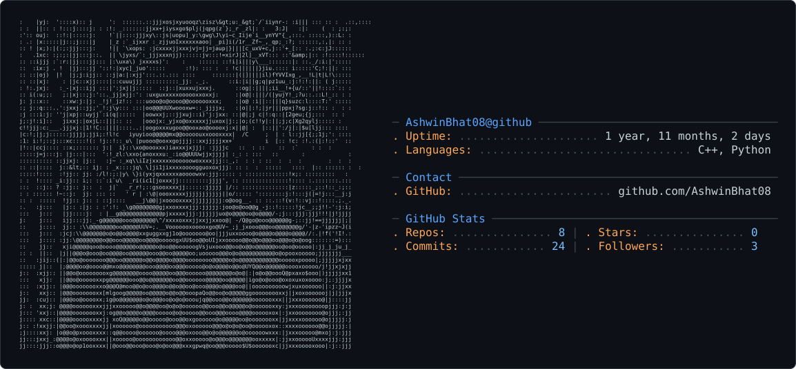

<picture>
  <source media="(prefers-color-scheme: dark)" srcset="dark_mode.svg" />
  <source media="(prefers-color-scheme: light)" srcset="light_mode.svg" />
  
</picture>

<p align="center">
  
</p>

<p align="center">
  
</p>

<p align="center">
  
  
</p>

---

<div align="center">

## `ABOUT_ME`

</div>

<table align="center">

<tr>

<td width="62%" valign="top">

```cpp
class Engineer {
public:
    string name = "Ashwin Bhat";

    string role =
        "4th Year Electronics & Communication Engineering Student";

    vector<string> interests = {
        "Embedded Systems",
        "Robotics",
        "Autonomous Systems",
        "ROS 2",
        "Artificial Intelligence"
    };

    string motto = "Build. Break. Learn. Repeat.";
};
```

I'm a **4th Year Electronics & Communication Engineering student** focused on building systems where **hardware, software, and intelligence meet**.

My work revolves around **embedded systems, robotics, autonomous navigation, and intelligent machines**.

Currently exploring how machines can **perceive, navigate, communicate, and work together**.

<br/>

### `FOCUS`

`EMBEDDED SYSTEMS` · `ROBOTICS` · `AUTONOMOUS SYSTEMS`

`INTELLIGENT MACHINES` · `AI` · `COMPUTER VISION`

</td>

<td width="38%" valign="top" align="center">


<br/><br/>


</td>

</tr>

<tr>

<td colspan="2" align="center" valign="middle">

<br/>


<tr>

<td colspan="2" align="center" valign="middle">

<br/>

### `TECH_STACK`

<br/>


  
<p align="center">
  
  
  
  
</p>
<br/><br/>

`C` · `C++` · `PYTHON` · `ARDUINO` · `RASPBERRY PI`   | 
`GIT` · `GITHUB` · `VS CODE` · `CMAKE` · `UBUNTU`  | 
`ESP32` · `ROS 2` · `SLAM` · `NAV2`

<br/>

</td>

</tr>
<div align="center">

<br/>

<table>

<tr>

<td width="33%" align="center" valign="top">

### 🤖 LUNA V2

**Semi-Humanoid Robotics Platform**

Building a robotics platform focused on **motion, control, interaction, and intelligent behavior**.

<br/>

`EMBEDDED SYSTEMS` · `SERVO CONTROL` · `ROBOTICS`

<br/>


</td>

<td width="33%" align="center" valign="top">

### 🔐 PHYLAX

**Intelligent Smart Access System**

A connected security system exploring **authentication, embedded intelligence, and IoT-based access control**.

<br/>

`EMBEDDED` · `SECURITY` · `IoT`

<br/>


</td>

<td width="33%" align="center" valign="top">

### 🌐 SWARM AI

**Multi-Robot Coordination System**

Exploring how autonomous robots can **communicate, coordinate, and operate as a collective system**.

<br/>

`ROS 2` · `COORDINATION` · `AUTONOMY`

<br/>

</td>

</tr>

<tr>

<td width="33%" align="center" valign="top">

### 🚗 AUTONOMOUS ROBOT

**Perception → Planning → Navigation**

Building an autonomous system capable of **understanding its environment and navigating safely**.

<br/>

`SENSOR FUSION` · `OBSTACLE AVOIDANCE` · `NAVIGATION`

<br/>


</td>

<td width="33%" align="center" valign="top">

### 🔗 ROS 2 NETWORK

**Distributed Robotics Infrastructure**

Experimenting with **robot-to-robot communication, distributed nodes, and scalable coordination**.

<br/>

`ROS 2` · `P2P COMMUNICATION` · `NETWORKING`

<br/>


</td>

<td width="33%" align="center" valign="top">

### 🛠️ POCKET TESTER

**Portable Electronics Diagnostic Tool**

A compact embedded device designed for **testing, debugging, and diagnosing electronic systems**.

<br/>

`EMBEDDED HARDWARE` · `TESTING` · `DIAGNOSTICS`

<br/>

</td>

</tr>

</table>

<br/>

<sub>
Building at the intersection of <b>hardware</b>, <b>software</b>, and <b>intelligence</b>.
</sub>

</div>

</div>

---

<div align="center">

## `CURRENTLY_LEARNING`

<br/>

`ROS 2 ADVANCED` · `SLAM` · `NAV2` · `EDGE AI`

<br/><br/>

`MULTI-ROBOT SYSTEMS` · `EMBEDDED LINUX` · `COMPUTER VISION`

</div>

---

<div align="center">

## `CONTRIBUTION_SNAKE`

<br/>

<picture>
  <source
    media="(prefers-color-scheme: dark)"
    srcset="https://raw.githubusercontent.com/AshwinBhat08/AshwinBhat08/output/github-contribution-grid-snake-dark.svg"
  />

<source
 media="(prefers-color-scheme: light)"
 srcset="https://raw.githubusercontent.com/AshwinBhat08/AshwinBhat08/output/github-contribution-grid-snake.svg"
/>

 </picture>

</div>

---

<div align="center">

> *Build systems that matter.*

</div>

<br/>

<p align="center">
  
</p>
